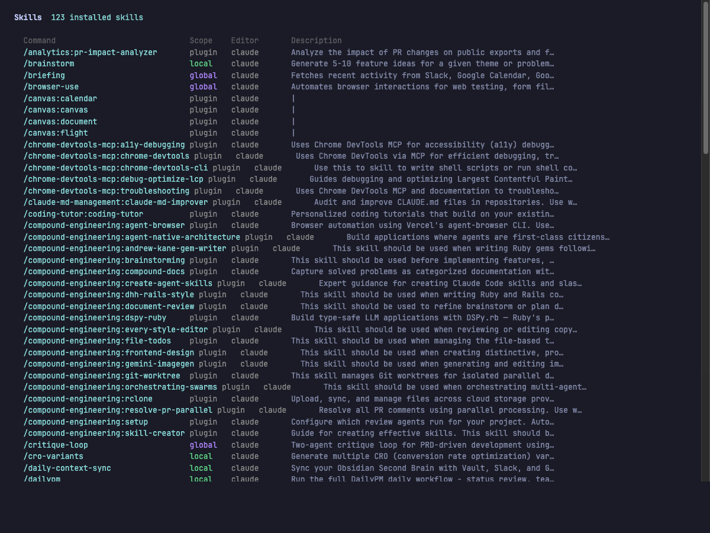
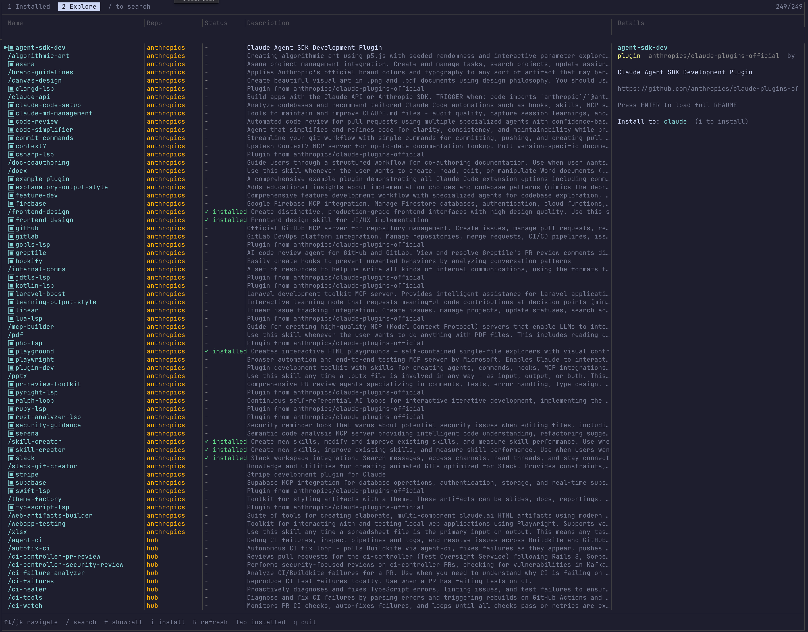

# Skill Browser

A terminal-first tool for discovering, browsing, and installing agent skills across multiple editors (Claude Code, Codex, Cursor, OpenCode, Pi). Explore remote marketplaces, search everything you have, install with a single command.





## Install

```bash
git clone https://github.com/morganholland/skills-browser.git
chmod +x skills-browser/*.sh

# Add to ~/.zshrc or ~/.bashrc
alias sb="/path/to/skills-browser/skill-browser-cli.sh"
```

Requires bash 4+, python3, and `gh` CLI.

## Usage

```bash
sb                          # Interactive TUI browser
sb explore                  # Browse remote marketplaces
sb search <query>           # Search (TUI when interactive, plain text when piped)
sb ai <query>               # Natural language search (uses Claude CLI)
sb ai <query> --json        # AI search with JSON output

sb list                     # List installed skills
sb list --json              # JSON output
sb list --local             # Project skills only

sb show <name>              # Detail view
sb install <name>           # Install a skill (auto-resolves deps)
sb install <name> --local   # Install to project
sb install <name> --global  # Install globally
sb install <name> --no-deps # Skip dependency auto-install
sb add <name>               # Shorthand for install --local

sb remove <name>            # Remove a skill
sb update                   # Update all skills
sb validate                 # Check all skills have valid SKILL.md
sb init                     # Create .claude/skills/ in current project

sb why <name>               # Show where a skill loads from
sb run <name> [args]        # Invoke a skill via its editor CLI
sb diff                     # Compare local vs global vs remote
sb stale                    # List skills older than 30 days
sb stale --days 7           # Custom staleness threshold
sb export                   # Export installed skills manifest
sb import                   # Install from manifest
sb import --dry-run         # Preview what would be installed
```

## Discovering Skills

The TUI has two tabs: **Installed** (your skills across all editors) and **Explore** (remote marketplaces). Use `/` to search, `?` for AI-powered natural language search, `f` to filter, `Tab` to switch tabs, `i` to install.

Built-in marketplaces:

| Repo | What's in it |
|------|-------------|
| [anthropics/skills](https://github.com/anthropics/skills) | Anthropic's official skills |
| [obra/superpowers](https://github.com/obra/superpowers) | Community superpowers |
| [levnikolaevich/claude-code-skills](https://github.com/levnikolaevich/claude-code-skills) | Community skills |
| [anthropics/claude-plugins-official](https://github.com/anthropics/claude-plugins-official) | Official Claude Code plugins |

Add your own:

```bash
sb add-repo myuser/my-skills
sb add-repo myuser/my-skills --path skills   # if skills are in a subdirectory
sb repos                                      # list all repos
sb remove-repo myuser/my-skills
```

## Multi-Editor Support

Auto-detects installed editors and scans all of them:

| Editor | Global | Project |
|--------|--------|---------|
| Claude Code | `~/.claude/skills/` | `.claude/skills/` |
| Codex | `~/.agents/skills/` | `.agents/skills/` |
| Cursor | `~/.cursor/rules/` | `.cursor/rules/` |
| OpenCode | `~/.config/opencode/skills/` | `.opencode/skills/` |
| Pi | `~/.pi/agent/skills/` | `.pi/skills/` |

Install to a specific editor with `--editor`:

```bash
sb install polaris --editor cursor
sb install polaris --editor all
```

## CLI Reference

| Command | Description |
|---------|-------------|
| `sb` | Interactive TUI browser |
| `sb explore` | Launch on Explore tab |
| `sb search <q> [--json] [-n N]` | Search skills |
| `sb ai <query> [--json]` | Natural language search (uses Claude) |
| `sb list [--local\|--global\|--json]` | List installed skills |
| `sb show <name>` / `sb info <name>` | Detail view |
| `sb install <name> [--editor <e>] [--local\|--global] [--no-deps]` | Install a skill (auto-resolves deps) |
| `sb add <name>` | Install to project (alias for `install --local`) |
| `sb remove <name> [--local\|--global]` | Remove a skill |
| `sb update [name] [--local\|--global]` | Update from source |
| `sb validate [path]` | Validate SKILL.md files |
| `sb init` | Create `.claude/skills/` directory |
| `sb explore-list [--json] [--type skills\|plugins] [query]` | List remote skills (pipeable) |
| `sb remote-show <name>` | Detail view for remote skill |
| `sb cats` | Group skills by category |
| `sb why <name>` | Show where a skill loads from |
| `sb run <name> [args]` | Invoke a skill via its editor CLI |
| `sb diff [--json]` | Compare local vs global vs remote |
| `sb stale [--days N] [--json]` | List skills older than N days |
| `sb export [--file F]` | Export installed skills manifest |
| `sb import [--file F] [--dry-run]` | Install from manifest |
| `sb repos` / `sb add-repo` / `sb remove-repo` | Manage marketplaces |
| `sb refresh` | Regenerate index |
| `sb fetch-remote` | Refresh remote cache |

### TUI Keys

| Key | Action |
|-----|--------|
| `j`/`k`, arrows | Navigate |
| `Enter` | Detail / load SKILL.md |
| `/` | Keyword search |
| `?` | AI search (natural language, uses Claude) |
| `f` | Cycle filter |
| `s` | Toggle sort |
| `i` | Install (Explore tab) |
| `R` | Refresh remote (Explore tab) |
| `Tab` | Switch tabs |
| `q` | Quit |

## License

[MIT](LICENSE)
